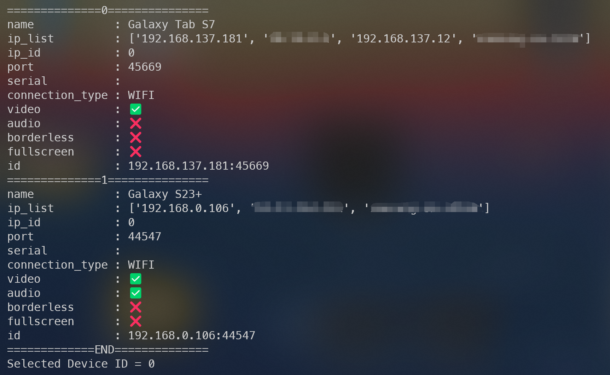

# Android Screen Casting (Windows)

- Share Android screen and audio to computer with the use of [scrcpy](https://github.com/Genymobile/scrcpy).
- Save device info and parameters to prevent re-typing every time connecting devices
- Provide a simple UI to simplify the use of scrcpy.

## How to use

1. Duplicate the file `/info/info_template.json` and rename the duplicated one to `info.json`
2. Update the information in `info.json` with your own device info and parameters
3. Run the Python script with commands

## Screenshots

